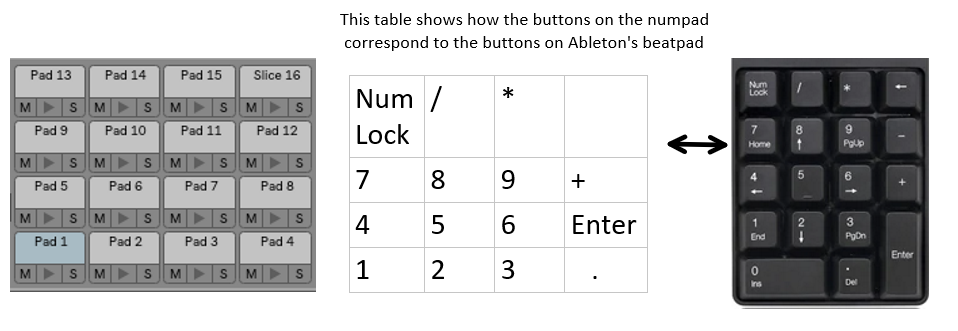

# Ableton Keyboard Numpad Beatpad

This is a script that remaps the numpad on your keyboard to work like a beatpad on Ableton.

All you have to do is download AbletonNumpadBeatpad.exe and run it after turning on "Computer MIDI Keyboard" mode in Ableton,
then you're ready to start jamming.

I have also included the original script file: AbletonNumpadBeatpad.ahk so you may easily change the numpad bindings in case 
you would like them laid out in a different way. To compile the script, however, you must
download AutoHotKey at autohotkey.com . The script is very simple and you can find any
keyboard numpad key codes you may need at autohotkey.com/docs/KeyList.htm 
